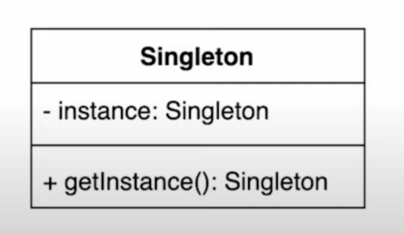
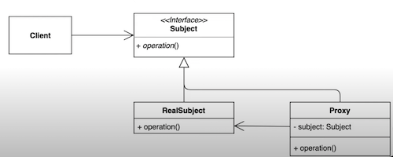

# _Design Pattern with Java_

## _Singleton_
### _인스턴스를 오직 한개만 제공하도록 클래스를 구현하는 디자인 패턴_

### _예제_
singleton 패턴으로 구현한 클래스를 살펴본다. 
* 공통
  * Settings: singleton 패턴을 적용한 클래스
* Setting class 를 버젼별로 나누어 주석 작성
  * V1~V7
* 결과: static inner class 사용 권장 (V7)

## _Proxy_
### _실제 기능을 수행하는 객체(Real Object) 대신 가상의 객체(Proxy Object)를 사용해 로직의 흐름을 제어하는 디자인 패턴_

### 장단점

* 장점:
  * 기존 코드 변경없이 새로운 기능 추가가 가능
  * `해야하는 일만 유지` 가능
  * `초기화 지연`
* 단점:
  * 코드 복잡도 증가

### _예제_

특정 함수가 실행되는 시간을 측정하는 기능을 proxy 패턴으로 구현한다.
* 공통
  * Client: gameService 를 호출하는 클라이언트
* before
  * proxy pattern 적용 전
* afterclass
  * proxy pattern 적용 시 적용 대상이 class 인 경우
* afterinterface
  * proxy pattern 적용 시 적용 대상이 interface 인 경우
  * GameServiceProxyV1: 생성자로 직접 interface 를 참조
  * GameServiceProxyV2: lazy initialization (함수 호출 시 인스턴스 생성ㄴ)

## _Reference_
* singleton
  * [https://www.youtube.com/watch?v=OwOEGhAo3pI](https://www.youtube.com/watch?v=OwOEGhAo3pI)
  * [https://www.youtube.com/watch?v=bHRETd1rFfc](https://www.youtube.com/watch?v=bHRETd1rFfc)
* proxy
  * [https://www.youtube.com/watch?v=tes_ekyB6U8](https://www.youtube.com/watch?v=tes_ekyB6U8)
  * [https://www.youtube.com/watch?v=267d9IfwRdc](https://www.youtube.com/watch?v=267d9IfwRdc)
  * [https://www.youtube.com/watch?v=z52yw8fnUSA](https://www.youtube.com/watch?v=z52yw8fnUSA)
