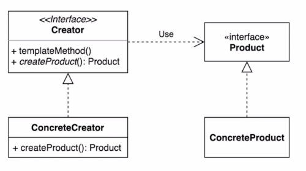
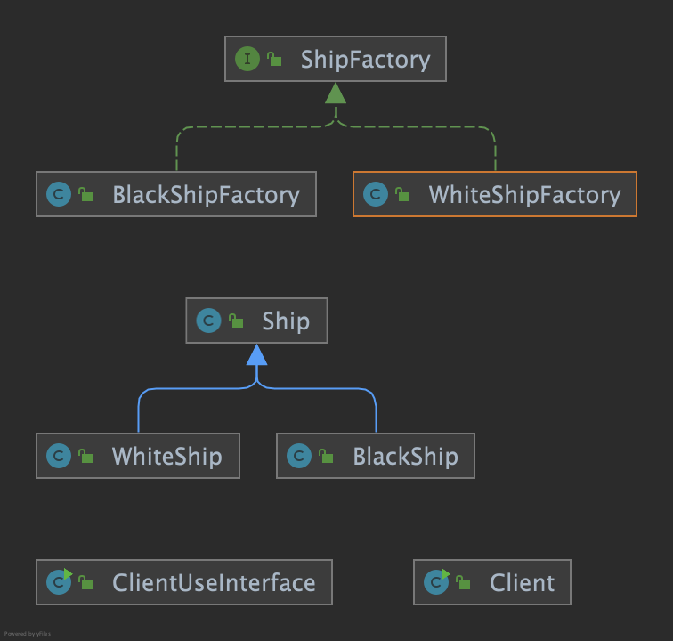
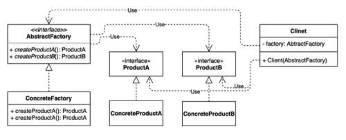
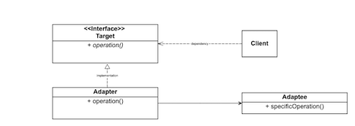
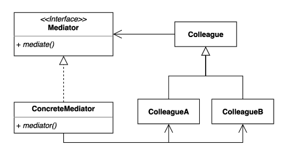

# _Design Pattern with Java_

## _객체 생성 관련 패턴_
### _Singleton_
#### _인스턴스를 오직 한개만 제공하도록 클래스를 구현하는 디자인 패턴_

#### _예제_
singleton 패턴으로 구현한 클래스를 살펴본다. 
* 공통
  * Settings: singleton 패턴을 적용한 클래스
* Setting class 를 버젼별로 나누어 주석 작성
  * V1~V8
  * V7: defacto
  * V8: enum 으로 reflection API 를 통한 인스턴스 생성 불가
* 결과: static inner class 사용 권장 (V7)
* singleton 을 깨트릴 수 있는 방법 2가지
  * reflection 을 사용하는 경우
    * 단, SettingsV8 와 같이 enum 으로 정의된 경우 reflection API 로 singleton 을 깨뜨릴 수 없음
  * 직렬 & 역직렬화 (대응가능, Serializable interface)

### _Factory_
#### _구체적으로 어떤 인스턴스를 만들지는 서브 클래스가 정하는 패턴_

#### _장단점_

* 장점:
  * OCP (기존 코드 변경 없이 새로운 인스턴스 생성에 확장이 가능)
  * Product & Creator(Factory) 간 느슨한 관계
* 단점:
  * 역할이 높아 클래스 수가 많아진다.

#### _예제_
Client 에서 ShipFactory 를 이용해 Ship 클래스의 인스턴스를 생성하는 예제
* before: factory 패턴 적용 전
* after: factory 패턴 적용 후
  * 
* afteruseabstract: factory 패턴 적용 & 추상 클래스 이용

### _Abstract Factory_
### _서로 관련 있는 여러 객체를 만들어주는 패턴(인터페이스 기반)으로 클라이언트 초점인 것이 특징_

#### _factory pattern 과의 차이점_
* 모양과 효과는 비슷: 객체 생성 과정을 추상화한 인터페이스를 제공
* 관점
  * abstract factory: factory 를 사용하는 방법에 초점 (composition)
  * factory: factory 를 구현하는 방법에 초점 (composition)
* 목적
  * abstract factory: 여러 객체를 구체적인 클래스에 의존하지 않고 생성하는 것
  * factory: 구체적인 객체 생성 과정을 하위 또는 구체적인 클래스로 옮기는 것

### _Proxy_
#### _실제 기능을 수행하는 객체(Real Object) 대신 가상의 객체(Proxy Object)를 사용해 로직의 흐름을 제어하는 디자인 패턴_

#### _장단점_

* 장점:
  * 기존 코드 변경없이 새로운 기능 추가가 가능
  * `해야하는 일만 유지` 가능
  * `초기화 지연`
* 단점:
  * 코드 복잡도 증가

#### _예제_

특정 함수가 실행되는 시간을 측정하는 기능을 proxy 패턴으로 구현한다.
* 공통
  * Client: gameService 를 호출하는 클라이언트
* before
  * proxy pattern 적용 전
* afterclass
  * proxy pattern 적용 시 적용 대상이 class 인 경우
* afterinterface
  * proxy pattern 적용 시 적용 대상이 interface 인 경우
  * GameServiceProxyV1: 생성자로 직접 interface 를 참조
  * GameServiceProxyV2: lazy initialization (함수 호출 시 인스턴스 생성ㄴ)

## _객체 생성 관련 패턴_
### _Adapter (어댑터) pattern_
#### _기존 코드를 클라이언트가 사용하는 인터페이스의 구현체로 변경하는 패턴_

#### _장단점_
* 장점:
  * 기존 코드 (`Account` & `AccountService`) 를 변경하지 않고 interface 구현체를 만들어 재사용 (OCP) 
  * 기존 코드 (`Account` & `AccountService`) 일과 특정 interface 구현체로 변환하는 작업을 각기 다른 클래스로 분리하여 관리 (SRP)
* 단점:
  * **새로운 클래스가 생겨 복잡도 증가**
    * 경우에 따라서는 기존 코드를 변경하여 interface 구현체로 변경하는 것이 더 나은 선택이 될 수 있음

#### _예제_
* before & after
* 클라이언트에서 사용하는 `Account` & `AccountService` 와, 외부 패키지로 사용하는 security 를 이용하고자 할 때
* `AccountUserDetails` & `AccountUserDetailsService` 를 각 security 인터페이스(`UserDetails`, `UserDetailsService`)를 상속받아 기능을 구현한다.
* 기존 코드(`Account` & `AccountService`) 를 변경하지 않고 Account 와 security 를 이어주는 기능을 interface 구현체로 따로 분리함

## _행동 관련 디자인 패턴_
### _Mediator pattern_
#### _여러 객체들 간 소통하는 방법을 캡슐화하는 패턴_

* 클래스 간 결합도를 중재자(Mediator, 혹은 Dispatcher) 를 통해 낮춘다.
* 레스토랑 예시를 들면 다음과 같다.
  * Restaurant, Guest, Gym, CleaningService 클래스가 있다고 가정한다.
  * Restaurant & Gym 에서 청소를 위해 CleaningService 를 참조한다.
  * 결합도를 낮추기 위해 청소 등을 **FrontDesk 라는 클래스를 생성**하여 이를 이용할 수 있다.

#### _장단점_
* 장점:
  * 컴포넌트 코드를 변경하지 않고 새로운 중재자를 만들어 사용할 수 있음 
  * 각각의 컴포넌트 코드를 보다 간결하게 유지 가능
* 단점:
  * 중재자 역할을 하는 클래스의 복잡도와 결합도가 증가

#### _사용 예시_
- java: `Executor`, `ExecutorService`
- spring: `DispatcherServlet`

# _Reference_
* singleton
  * [https://www.youtube.com/watch?v=OwOEGhAo3pI](https://www.youtube.com/watch?v=OwOEGhAo3pI)
  * [https://www.youtube.com/watch?v=bHRETd1rFfc](https://www.youtube.com/watch?v=bHRETd1rFfc)
* proxy
  * [https://www.youtube.com/watch?v=tes_ekyB6U8](https://www.youtube.com/watch?v=tes_ekyB6U8)
  * [https://www.youtube.com/watch?v=267d9IfwRdc](https://www.youtube.com/watch?v=267d9IfwRdc)
  * [https://www.youtube.com/watch?v=z52yw8fnUSA](https://www.youtube.com/watch?v=z52yw8fnUSA)
* other...
  * [https://www.inflearn.com/course/디자인-패턴](https://www.inflearn.com/course/디자인-패턴)
